# Pack Generator: geplante Vorhaben

Stand 10.10.2026. Die Übersicht über alles, was geplant ist, mit Warum, Was, Beispiel und Stand. Sie ist der Massstab für den Kurs-Check (unten). Die Beispiele sind zur Veranschaulichung erfunden (Zahlen, Orte, Zeiten).

## Kurs-Check: sind wir auf dem richtigen Weg?

Diese Datei wird geprüft:

- **vor jedem neuen Paket** (bevor Mockups entstehen): Passt das Paket zu einem der vier Ziele unten und zur Reihenfolge? Wenn nicht: Noah fragen, ob das Ziel oder die Reihenfolge ändert.
- **in jedem Release-PR**: Abschnitt «Stand heute» und den Stand des Vorhabens nachführen. Neue Entscheide von Noah hier und in `decisions.md` eintragen.
- **etwa alle fünf Releases**: kurzer Kurs-Check an Noah. Pro Ziel ein Satz, was erreicht ist, was fehlt und ob die Reihenfolge noch stimmt, mit a/b-Fragen, falls etwas abweicht.

Prüffragen:

1. Dient es einem der vier Ziele, und merkt Noah den Nutzen im Alltag oder auf Tour?
2. Bleibt alles ein Vorschlag, nie Pflicht, immer änderbar?
3. Bleiben private Daten auf dem Gerät und aus dem Repo?
4. Braucht es einen fremden Dienst, wo eine eigene, schlanke Lösung reicht?
5. Wurde die letzte grössere Version schon echt benutzt?

## Kurz gesagt

Der Pack Generator ist eine persönliche Web-App (PWA) für Bikepacking- und Velotouren. Sie hilft beim Packen, beim Planen und beim Lernen aus vergangenen Touren. Daten liegen nur auf dem Gerät (IndexedDB), es gibt kein Konto. Die App läuft offline und lässt sich auf Computer und Handy installieren.

Die geplanten Vorhaben verfolgen vier Ziele:

1. **Schneller packen.** Vorschläge statt leerer Listen: Bausteine, Vorlagen und ein KI-Helfer, der aus dem eigenen Material eine Liste vorschlägt. Beispiel: «3 Tage Jura, 5 °C, Biwak» ergibt eine fertige Liste mit Begründungen.
2. **Das Velo im Griff haben.** km pro Velo (später automatisch aus Strava), Wartung von Kette, Kassette, Bremsbelägen, Bremsscheiben und Reifen mit konkreten Hinweisen. Beispiel: «Kette 2 400 km seit Wechsel, mit der Lehre 0,5 messen.»
3. **Von der Haustür bis zurück.** Eine Startseite, die sich der Phase anpasst (vor, während, nach der Tour), mit SBB, swisstopo-Karte, Wetter und dem Knopf «Take me home».
4. **Aus jeder Tour lernen.** Rückblick, Learnings, die beim nächsten Packen wieder auftauchen, und ein Aktivitätsmosaik über alle Sportarten und Meditation.

Durchgehende Grundsätze: Alles ist ein Vorschlag, nie Pflicht, und immer änderbar. Private Daten bleiben privat. Keine fremden Dienste, wenn es eine eigene, schlanke Lösung gibt.

## Stand heute (10.10.2026)

| Version | Inhalt | Stand |
| --- | --- | --- |
| 0.65.0 | Velo-Masse: Sattelhöhe, Rahmengrösse, Lenkerbreite pro Velo, Import aus Datei | live |
| 0.66.0 | Bausteine neu (Biwak, Zelt, Hotel, Kochen, Erste Hilfe, Reparatur, Laden, Licht, Rennen, Essen, Hygiene, Komfort) und «Bausteine prüfen» | fertig, wartet auf Freigabe |
| – | KI-Helfer (siehe unten) | wird fertig gebaut, dann als Entwurf geparkt |
| – | Startseite & Integrationen E1–E4 | Konzept fertig, Mockups werden gezeichnet |

Was die App heute schon kann: Material mit Gewicht und Kategorie, Touren mit Packliste, Vorlagen, Bausteine, Temperaturbereiche, Velos mit Teilen und Pflege («Jetzt fällig»), Notizen unterwegs, Rückblick mit Learnings, Einkaufsliste, Belege, Sicherung als Datei (der einzige Weg, Daten zwischen Computer und Handy zu übertragen), Deutsch und Englisch, hell und dunkel.

## Die Vorhaben

### 1. Bausteine neu (0.66.0)

- **Warum:** Die alten Bausteine (Basis, Warm, Schlafen, Licht, Unterkunft) waren zu grob. «Unterkunft» mischte Zelt und Hotel, «Warm» doppelte die Temperaturregeln.
- **Was:** 12 klare Bausteine: Biwak, Zelt, Hotel/Hütte, Kochen, Erste Hilfe (immer dabei, klein oder voll), Reparatur, Laden, Licht (kommt mit Dunkelheit), Rennen, Essen, Hygiene, Komfort. Dazu die Seite «Bausteine prüfen», um jeden Baustein durchzugehen. Eine Migration verteilt die alten Bausteine automatisch, die alten Schlüssel bleiben zwei Versionen erhalten.
- **Beispiel:** Neue Tour «2 Nächte, Hütte» schaltet Hotel/Hütte, Hygiene und Laden ein, Biwak und Kochen bleiben aus.
- **Stand:** fertig, alle Tests grün, wartet auf Freigabe.

### 2. KI-Helfer (gebaut, geparkt)

- **Warum:** Viel Wissen steckt schon in der App (Material, Learnings, km, Notizen), aber man muss es selbst zusammensuchen. Der Helfer macht daraus Vorschläge. Noahs wichtigster Wunsch: sinnvolle Wartungsvorschläge.
- **Was (Antworten 1–8 a):**
  1. Karte oben im Dialog «Neue Tour»: verstandene Bedingungen als Chips, Bausteine, 4–6 Teile aus dem eigenen Material mit Grund, «Übernehmen» oder «Verwerfen».
  2. Suche antwortet nur bei einer Frage («?» oder Enter). Normale Suche bleibt gratis und lokal.
  3. Rückblick: Knopf «Entwurf holen» macht aus den Notizen unterwegs bis zu 3 Learnings und eine kurze Zusammenfassung.
  4. «Liste prüfen» im •••-Menü und beim Schritt «Weiter: Packen»: Fehlt vielleicht, Doppelt, Schwer (mit leichterer Alternative).
  5. Wartung: Vorschläge für Kette, Kassette, Bremsbeläge, Bremsscheiben, Reifen erscheinen in der bestehenden Liste «Jetzt fällig», mit Helfer-Zeichen.
  6. Neu gerechnet nach neuen km oder einer neuen Fahrt, höchstens einmal pro Tag.
  7. Monatsgrenze CHF 5, danach Pause bis zum nächsten Monat.
  8. Hinweis «noch nicht eingerichtet» nur in Neue Tour und Einstellungen.
- **Beispiel Wartung:** «Kette: 2 400 km seit Wechsel, viele Regenfahrten. Mit der Lehre messen: ab 0,5 bald wechseln, ab 0,75 sofort.» Oder: «Bremsbeläge hinten: unter 1 mm Belag wechseln. Mindestdicke der Scheibe steht auf der Scheibe.»
- **Technik:** kleiner Server auf Vercel (`api/helper.js`) hält den Anthropic-Schlüssel. Die App schickt nur, was die Aufgabe braucht: Namen, Gewichte, Bausteine, Notizen, km. Nie Fotos, Belege, Gesundheitsdaten oder Namen von Personen.
- **Stand:** wird fertig gebaut und getestet, dann als Entwurf geparkt (Noah, 10.10.2026). Eingeschaltet wird er nach E2–E4; dann richtet Noah den Schlüssel ein (Anleitung `docs/ki-helfer-einrichten.md`).

### 3. Startseite & Integrationen (E1–E4)

- **Warum:** Die Startseite soll zeigen, was gerade zählt, je nach Phase: vor, während oder nach einer Tour. Dazu kommen die Dienste, die Noah sowieso braucht (SBB, swisstopo, Wetter, Strava), aber als eigene Karten statt fremder Einbettungen: offline-fähig, ohne Tracker.
- **Grundlage:** Heimat-PLZ als Einstellung auf dem Gerät, überall der Standard-Standort. Sie steht nie im Repo; Testdaten nutzen erfundene Orte. Echter Standort nur auf Knopfdruck.
- **E1 Startseite neu:** 6 Module je Phase, weitere wählbar. Ohne Tour: nächste Idee, Aktivität, Wartung. Vor der Tour: Startklar (was fehlt noch), Wetter, Anreise-Knöpfe (SBB, Auto, Karte, .ics in den Kalender). Unterwegs: Notiz, Wetter, «Take me home». Danach: Rückblick, Learnings. Kein Server nötig.
- **E2 Karten und Wetter:** swisstopo-Karte in der App mit Route und Höhenprofil (ausserhalb der Schweiz OSM). Eigene Wetterkarten für Start und Ziel plus Knopf zu MeteoSchweiz. Tourideen nur als Links zu Noahs komoot-Sammlungen.
- **E3 Strava und Aktivität:** der vorbereitete Strava-Server geht live. km pro Velo automatisch, Aktivitätsmosaik über alle Sportarten plus Meditation (von Hand) mit Zielen.
- **E4 Anreise in der App:** SBB-Verbindungen direkt in der App (transport.opendata.ch), nächster Zug nach Hause.
- **Take me home:** Knopf während der Fahrt. Er nimmt den aktuellen Standort und öffnet den schnellsten Weg zur Heimat-PLZ: ÖV über die SBB-App, Auto über Google Maps.
- **Beispiel:** Samstag 7 Uhr, Tour Jura geplant: die Startseite zeigt «Startklar: 2 Teile fehlen», Wetter Start 6 °C, Ziel 9 °C, und den Zug 7:32 ab Zürich HB. Am Nachmittag, platt in Le Brassus: «Take me home» zeigt den nächsten Zug.
- **Stand:** Konzept fertig und beantwortet, Mockups für alle Etappen werden gezeichnet (nur hell).

### 4. Design-Pakete D1–D6

- **Warum:** Aus dem Strategie-Dokument (119 Fragen, alle beantwortet, siehe `strategie-pakete.md`). Die App soll schön, ruhig und am Computer ein echtes Werkzeug sein.
- **D1 Aufpimpen:** Farbwelt Gletscher, Dunkelmodus überall, Karten statt Tabellen am Handy. Erledigt.
- **D2 Einkaufszettel, Lebenslauf, Werkstatt:** in einem Release. Lebenslauf zeigt pro Teil, wann gekauft, gewartet, ersetzt.
- **D3 Navigation «Basecamp»:** untere Leiste Heute · Unterwegs · Aktiv · Neuland · Mehr, Akzentfarbe pro Welt, am Computer Seitenleiste und Tastenkürzel.
- **D4 Computer als Werkzeug:** Material als Tabelle mit wählbaren Spalten, Packen mit Liste, Velo-Skizze und Gewichtsverteilung nebeneinander, Pflege-Kosten pro 1000 km.
- **D5 Packen vorschlagen:** Neue Tour startet mit fertiger Liste aus ähnlichen Touren (auch Region und Höhenmeter), Wetter und Kits. In drei kleinen Releases. Wetter immer überschreibbar.
- **D6 Lernen sichtbar:** Seite «Was die App gelernt hat» mit «stimmt nicht», «warum» bei jedem Vorschlag, Monatskarte, Jahres-Brief im Dezember.

### 5. Übergänge Teil 1 und Touren-Einstieg

- **Warum:** Man soll nirgends stecken bleiben. Heute landet «Touren» mitten in einer Packliste.
- **Was:** drei kleine Releases. Ruhige Zwischenseite «Packen erledigt ✓» mit einem grossen Weiter-Knopf. «Weitermachen: Tour X, Schritt 3 von 4» auf Heute. Schrittleiste Planen · Packen · Unterwegs · Rückblick auf allen Tour-Seiten. Jede Seite hat einen Hauptknopf «Weiter zu …». Eine Touren-Einstiegsseite listet Touren nach Zustand (in Planung, gepackt, Rückblick offen, fertig), Vorlagen und Bestwerte.
- **Beispiel:** Nach dem letzten Tourtag erscheint am Abend automatisch «Tour abschliessen?» mit Knopf «Zur Startseite».

### 6. Im Flow (Aktiv)

- **Warum:** Neben Velo sollen alle Sportarten, Meditation und Erholung an einem Ort stehen, mit Zielen.
- **Was:** eigener Bereich Aktiv. Ziele pro Sportart, zum Beispiel Meditation täglich, Tennis 1 pro Woche, Laufen alle 10 Tage, Velo draussen 3 pro Woche (Pendeln zählt). Meditation im Vollbild mit Gong, Rituale (Morgen plus zwei weitere), Tagescheck mit einem Tipp pro Frage (1–10), Zitate nur mit Quelle. Stufen-Heft: Pfade mit 7 Stufen, jede Stufe ein Stempel mit Datum, Satz und Foto (zum Beispiel «Leichter Packer», «Allwetter», «Ultra»). Fitbit-Werte (Ruhepuls, HRV) nur als Beobachtung.

### 7. Server-Pakete S1–S5

- **Warum:** Manches geht nur mit einem kleinen Server, weil ein geheimer Schlüssel nötig ist. Die App selbst bleibt auf GitHub Pages, damit die Daten auf dem Gerät bleiben.
- **S1 Strava:** Fahrten automatisch holen (Garmin kommt über Strava mit), km pro Velo, Trainer- und Zwift-Fahrten zählen zum Velo. Server ist vorbereitet und geparkt, kommt mit E3.
- **S2 Erinnerungen:** Push mit Ein-Tap-Antwort, Unwetter-, Hitze- und Nullgrad-Warnungen.
- **S3 Fitbit und Kalender:** Ruhepuls, HRV, Schlaf als Beobachtung; Google Kalender in beide Richtungen.
- **S4 KI-Helfer:** wird jetzt fertig gebaut und als Entwurf geparkt, eingeschaltet nach E2–E4.
- **S5 Kleine Anbindungen:** Sonnen- und Mondzeiten, Wikipedia/OSM-Kurztexte, Teilen an die App. SBB und komoot sind in Startseite & Integrationen aufgegangen.

### 8. Neuland (N1)

- **Warum:** Neue Gegenden entdecken statt immer dieselben Runden.
- **Was:** Karte mit «weissen Flecken» (wo noch keine GPX-Fahrt war), Pässe und Gipfel in Velodistanz, Liste nach Aufwand, Rennkalender Europa mit Anmeldeschluss-Hinweis, «Aus Rennen planen» als Event-Tour.
- **Beispiel:** «12 Pässe über 1500 m in 80 km Umkreis, noch nie gefahren. Am nächsten: Ibergeregg.»

### 9. Weitere Wünsche (geparkt oder später)

- **Fotoalbum:** Fotos von Velo und Abenteuern hinter der Karte «Nächste Tour», bei jedem Öffnen ein anderes. Mockups beantwortet, Code geparkt.
- **Teile pro Velo und Velos vergleichen:** Standard-Teilevorlage für alle Velos (Rahmen, Antrieb, Bremsen, Räder, Cockpit, Zubehör, 12 Geometrie-Werte) und eine Vergleichstabelle der Velos.
- **Excel-Import:** Kleiderschrank und Material aus einer eigenen Excel-Liste mit Vorschau «Import prüfen». Grossteils gebaut, alte Touren nur als Notizen.
- **Tauschen und Outfit:** einzelne Kleider situativ tauschen und als Outfit speichern (mit D5).
- **Mehrfachauswahl:** viele Teile markieren und gemeinsam einer Kategorie, Tasche oder einem Baustein zuweisen.
- **Fallen gelassen:** Foto-KI (Teil fotografieren, App erkennt es), Live-Sync über Drive.

## Reihenfolge

Taktgeber ist echte Nutzung: Eine grössere Version kommt erst, wenn die letzte im Alltag oder auf einer Tour benutzt wurde.

Noah, 10.10.2026: zuerst die Design-Pakete und die anderen Vorhaben, der KI-Helfer kommt später dazu.

```mermaid
flowchart LR
  B["0.66 Bausteine<br/>Freigabe"] --> U["Übergänge Teil 1"]
  U --> D3["D3 Navigation Basecamp"]
  D3 --> E1["E1 Startseite neu"]
  E1 --> D5["D5 Packen vorschlagen"]
  D5 --> D2["D2 Einkauf, Lebenslauf, Werkstatt"]
  D2 --> D46["D4 und D6"]
  D46 --> E24["E2–E4 Karten, Strava, SBB"]
  E24 --> KI["KI-Helfer einschalten"]
  KI --> R["Im Flow, Neuland"]
```

1. Übergänge Teil 1 (drei kleine Releases)
2. D3 Navigation «Basecamp», danach E1 Startseite neu
3. D5 Packen vorschlagen
4. D2 Einkauf, Lebenslauf, Werkstatt
5. D4 und D6
6. E2 bis E4 (Karten, Strava, SBB)
7. KI-Helfer einschalten: er ist fertig gebaut und getestet und wartet als Entwurf. Er kommt bewusst nach D2 und Strava, weil er dann die Wartungsgeschichte jedes Teils und die echten km kennt.
8. Danach Im Flow und Neuland.

Die zwei kleinen Fehler (Datum, Velotypen) kommen später.

Vor jedem Paket prüfen wir, ob die Reihenfolge noch stimmt (Kurs-Check).

## Wie wir arbeiten

Kurzfassung, verbindlich ist [arbeitsweise.md](arbeitsweise.md).

- **Ein Paket aufs Mal,** höchstens zwei gleichzeitig.
- **Ablauf pro Paket:** Konzept (bei grossen Paketen) → Mockups (nur hell, Computer 1440 px und Handy 390 px, erfundene Daten) → Noah schaut sie an → a/b-Fragen mit ★-Empfehlung, Antwort zum Beispiel «1-8a» → Bau → Pull Request.
- **Vorschläge sind nie Pflicht:** alles lässt sich ändern oder abwählen, überall.
- **Tests:** vor jedem Pull Request läuft der komplette Gesamttest lokal (Computer und Handy, je zwei Teile). Tests lesen ihre Listen aus dem App-Code statt Kopien zu führen.
- **Freigabe:** Claude mergt nie. Wenn alles grün ist, klickt Noah «Merge pull request» → «Confirm merge».
- **Trello:** jeder Pull Request hat eine Karte. «PG · Zur Freigabe», nach dem Merge «PG · Zu testen», nach dem Test erledigt.
- **Jede Version** hat «Was ist neu» (Deutsch und Englisch), aktualisierte Doku (Status, Entscheide, Roadmap, diese Datei) und eine Versionsnummer, die bei überholten offenen PRs nachgezogen wird.
- **Sprache:** App-Texte auf Englisch und Deutsch, Gespräch auf Deutsch, kurz.

## Technik und Dienste

| Teil | Was | Kosten |
| --- | --- | --- |
| App | Svelte 5, Vite, Dexie (IndexedDB), PWA, offline | gratis |
| Hosting App | GitHub Pages (Repo ist öffentlich) | gratis |
| Server | Vercel Functions im selben Repo (`api/`), Upstash Redis für Tokens und Zähler | gratis (Free Tier) |
| KI-Helfer | Anthropic API über den Server | Grenze CHF 5 pro Monat |
| Strava | eigene API-App, Geheimnis nur in Vercel | gratis |
| Karten | swisstopo, ausserhalb der Schweiz OSM | gratis |
| Wetter | eigene Karten aus freien Wetterdaten, Knopf zu MeteoSchweiz | gratis |
| ÖV | transport.opendata.ch, Knopf zur SBB-App | gratis |
| Daten zwischen Geräten | Sicherungsdatei (kein Live-Sync) | gratis |

**Datenschutz:** Persönliche Daten (Excel, Belege, Fotos, GPX, Sicherungen, echte Velo-Daten, Heimatadresse) kommen nie ins öffentliche Repo. Testdaten sind erfunden. Schlüssel liegen nur in Vercel. Gesundheitswerte sind nur Beobachtung, nie Bewertung.

## Bewusst nicht und offene Punkte

**Bewusst nicht:**

- Keine native App, die Web-App bleibt.
- Keine Konten für andere. Teilen bleibt einseitig.
- Keine fremden Einbettungen (Windy, komoot-Karten) und keine fremden Werkzeuge wie Todoist, n8n, Paperless, Dify oder Algolia. Aufgaben, Suche, Belege und Assistent sind in der App.
- Keine Foto-KI für Material und kein Live-Sync über Drive.
- Die App zieht nicht auf Vercel um, sonst blieben die Daten im Browser zurück.

**Offen:**

- KI-Helfer: Noah legt Schlüssel und Helfer-Code in Vercel an.
- Startseite: Mockups E1–E4 anschauen und Fragen beantworten.
- Zwei kleine Fehler (kommen später): Datum in Neue Tour als 10/10/2026 statt 10.10.2026, Velotypen in Velos › Pflege nicht übersetzt.
- Strava-Regeln schränken die Nutzung von Strava-Daten durch KI ein; vor E3 klären, was der Helfer davon sehen darf.
